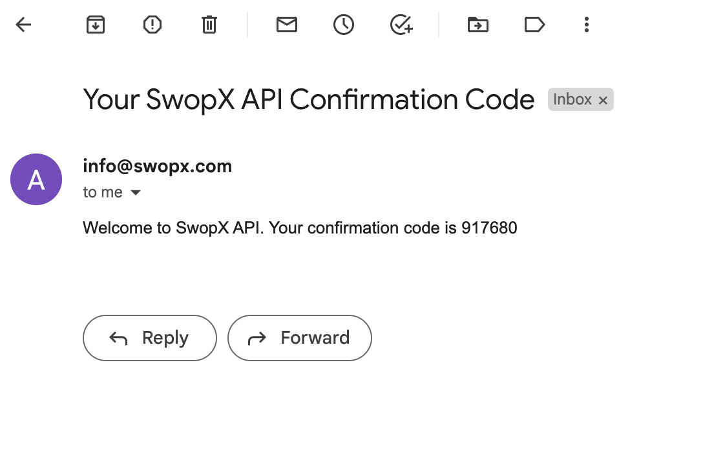

__Confirm and Verify Your Email__

A confirmation code 🔐 will be sent to your email address and to confirm your request.


```API
  POST /api/confirm
```

https://external-dev.swopx.com/confirm


| Parameter | Type     | Description                |
| :-------- | :------- | :------------------------- |
| `email`       | `string`      | **Required**. Your API email |
| `code`        | `string`      | **Required**. A code received on your email |
| `password`    | `string`      | **Required**. Your API password |


<!-- tabs:start -->

#### **POST**

```
Example of register 
{
    "email": "admin@example.com",
    "code": "xxx",
    "password: "xxxx"
} 
```

#### **Response**
```
{
    "success": true,
    "message": "Check your email"
}

```

<!-- tabs:end -->

__________

__________


Once you've confirmed your account, your account set-up process is complete, and you may sign in.

________


__Forget Password__

```API
  POST /api/forgot
```

https://external-dev.swopx.com/forgot


| Parameter | Type     | Description                |
| :-------- | :------- | :------------------------- |
| `email`       | `string`      | **Required**. Your API email |

